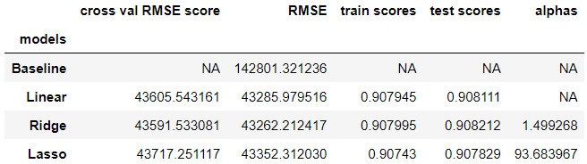
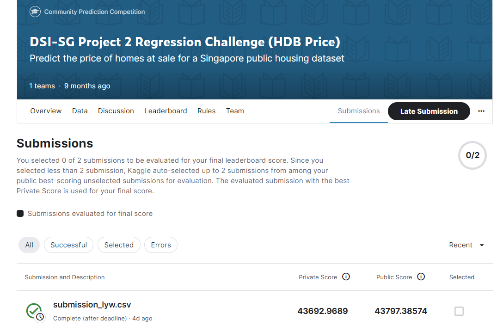

# Project Name: Predicting HDB Resale Prices

## 1. Overview
The aim of this project was to create a regression model using the Singapore Housing Dataset to predict house prices at sale. The evaluation metric used for this project was the Root Mean Squared Error (RMSE). The Train CSV file provided contains transactions data from March 2012 to April 2021.

To handle missing values, the null values for the "Mall_Nearest_Distance" feature were imputed using the mean value of the "Mall_Nearest_Distance" for each town.

Additional features were introduced by extracting data from the internet. These features included "top_20_ps," "top_20_ss," "hdb_index," "town_central," and "top10_town."

Multicollinearity was detected between "hdb_age" and "age_tranc" with a correlation coefficient of 0.97. Consequently, "hdb_age" was dropped from the feature set.

In total, 177 features were used from the original 75 features in the Train CSV file to train the regression model.

Three machine learning models were employed and compared against a baseline model. Among them, the Ridge Model was selected as the best performing model based on its RMSE score.

The Ridge Model achieved a ***RMSE score of 43,797*** on Kaggle, demonstrating its effectiveness in predicting house prices in the Singapore Housing Dataset.

## 2. Problem Statement
In Singapore, HDB flat owners typically buy and sell property via agents.
Buyers and sellers are at the mercy of the final price quoted, before including the processing and commission fees. 
Absence of pricing model can lead to uncertainty and unfair pricing.

### Who we are:
A group of data scientist looking to launch an online platform that enables end-users to estimate HDB flats resale price online. 

### Target Audience: 
Potential HDB flat buyers or sellers.

## 3. Goal
Create a predictive model that estimates the resale price of HDB flats based on historical prices and property attributes.
This empowers users with a fair valuation alternative to prices quoted by property agents.

## 4. Jupyter Notebooks
* EDA: 01_eda.ipynb
* Modelling: 02_modeling.ipynb

## 5. Version
* The version of the Jupyter notebook server is: 6.5.4
* Python 3.11.3

## 6. Data Sources

* DSI-SG Datsaset: Kaggle (https://www.kaggle.com/competitions/dsi-sg-project-2-regression-challenge-hdb-price/data)

(The Train CSV file obtained contains transactions data from March 2012 to April 2021.)

* HDB Price Index: Singstat(https://tablebuilder.singstat.gov.sg/table/TS/M212161)
* Primary School Ranking : Schoolbell (https://schoolbell.sg/primary-school-ranking/)
* Secondary School Ranking : Schoolbell (https://schoolbell.sg/secondary-school-ranking/)
* HDB Town: HDB (https://www.hdb.gov.sg/about-us/history/hdb-towns-your-home)
* Top 10 Most Popular HDB: Yahoo SG (https://sg.finance.yahoo.com/news/top-10-most-popular-hdb-020000687.html)

## 7. Data Files for Data Cleaning and EDA
* Train data: train.csv
* Test data: test.csv

## 8. Data Files for Modelling
* Train data: house_df1.csv
* Test data: house_df1_test.csv
* Kaggle Submission: submission_lyw.csv

## 9. Models
* Null Model (baseline)
* Linear Regression
* Ridge L2
* Lasso L1
## 10. Model Evaluation Metric
Root Mean Squared Error

## 11. Results

## 12. Conclusions and Recommendations

### Conclusion
Now that we have a model to predict HDB resale price, our users will be able to get a grasp of a fairer pricing as well as managing their expectaton of the HDB units better. The users will also have more bargaining power as a buyer or seller.

Model could account for ***90%*** of variability in HDB resale prices.

Using the Ridge model, we are able to evaluate property price fairly.

On average, our model predictions deviate from the true house prices by approximately +/-$40,000.
With the findings from:
#### * Top features that are positively correlated with sale price (Ridge modeling)
#### * Top features that are negatively correlated with sale price (Ridge modeling)

The features that contributing to higher HDB resale price are:

* floor_area_sqm: Holding all other features fixed, a 1 unit increase in the unit floor area (sqm) is associated with an increase of  ***$\$$77,177.***

* town_BEDOK: Holding all other features fixed, HDB located at Bedok is associated with an increase in house price of ***$\$$33,596.***

* mrt_name_Tiong Bahru: Holding all other features fixed, HDB located near Tiong Bahru MRT Station is associated with an increase in house price of ***$\$$25,837.***

* town_MARINE PARADE: Holding all other features fixed, HDB located at Marine Parade is associated with an increase in house price of ***$\$$19,202.***

* max_floor_lvl: Holding all other features fixed, a 1 unit increase in the maximum floor level of a HDB is associated with an increase of  ***$\$$18,290.***

 

On the contrary, the features that contributing to lower HDB resale price are age of HDB during transaction, distance of nearest mrt station, HDB located near Bedok Reservoir or Kaki Bukit MRT Station and HDB located at Bukit Batok.

### Recommendation

#### On the buyer standpoint:
If a buyer have a tight budget, the individual can opt for units that has smaller floor area, choosing locations such as Bukit Batok or having Bedok Reservoir or Kaki Bukit as the nearest MRT station. Or even, getting a unit with lower number of floor levels.

#### On the seller standpoint:
The recommendation is to sell the house as soon as possible once the Minimum Occupancy Period has ended to maximise the resale value of the HDB. But that also comes with units that are located at Marine Parade or Bedok or even having Tiong Bahru as the nearest MRT station.

## 13. Further Improvements

* To have better domain knowledge such as get consulted by subject matter experts (SME) to better deal with the outliers that were seen when performing the EDA and better understanding the importance of the features to further reduce any redundancy.

* To have better feature engineering by getting consulted by the SME.

* Introduce more features such as traveling time of flats from certain locations.

* Factoring on government policies into our analysis and data modelling.

## 14. Presentation Slides
hdb_resale_price.pdf
